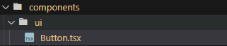
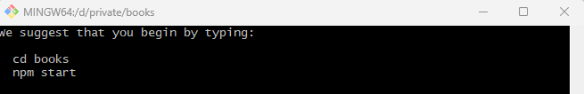
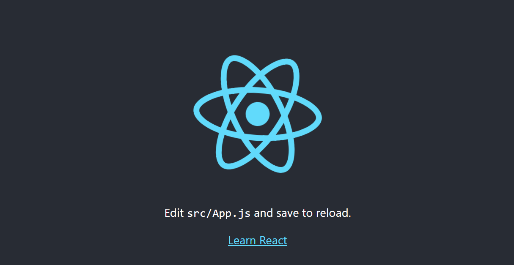
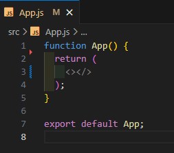
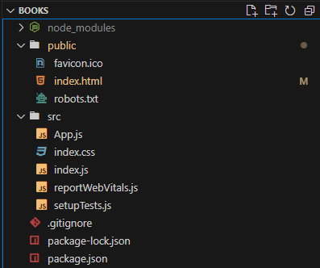

지금 진행하는 사이드 프로젝트는 동네에서 중고책 구매를 좀 더 원할하게 하기 위해 만듭니다. 중고매장에 팔 때는 싸게 살 때는 비싸게 사야되고 동네 근처에서 구매해서 택배비도 아낄 수 있는 걸 목표로 하고 있습니다. 추후에는 도서관 등 문화 시설의 행사 같은 내용도 알릴 수 있도록 만들려고 합니다.

이 사이드 프로젝트는 리액트로 진행합니다. 그리고 인증이나 데이터베이스는 파이어베이스를 사용하도록 하겠습니다. 우선 리액트 프로젝트를 books라는 이름으로 CRA를 통해 생성하겠습니다. --typescript는 타입스크립트를 리액트 프로젝트에 사용하겠다는 걸 명시한 것입니다. 시간이 된다면 타입스크립트 사용하는 것까지 진행해보도록 하겠습니다.

```jsx
npx create-react-app books --template typescript
```



생성이 완료되면 아래와 같은 메세지를 볼 수 있다.


메세지를 입력해 리액트 앱을 실행시킵니다.

```jsx
cd books
npm start
```


그러면 다음과 같은 창이 뜨는 걸 확인할 수 있습니다. 리액트 생성이 정상적으로 되었습니다.
CRA는 react

2. 파일 제거
1. public

- favicon.ico: 추후 변경될 때까지 유지

- logo192.png, logo512.png: react 이미지 제거

- manifest: 웹앱에 대한 정보를 담고 있는 파일이다.

- index.html: 사용하고 있는 logo192.png, manifest를 제거하므로 수정이 필요

```jsx
<!-- 제거 -->
<link rel="apple-touch-icon" href="%PUBLIC_URL%/logo192.png" />
<link rel="manifest" href="%PUBLIC_URL%/manifest.json" />
```

2. src

- App.css: App.js 스타일

- App.test.js: App.js 테스트 코드

- logo.svg: 사용하지 않으므로 제거

- App.js: 수정이 필요
  

3. 변경 후 프로젝트 구조
   

여기까지 했다면 프로젝트를 시작할 준비가 어느정도 되었다.
