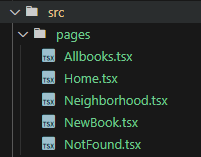
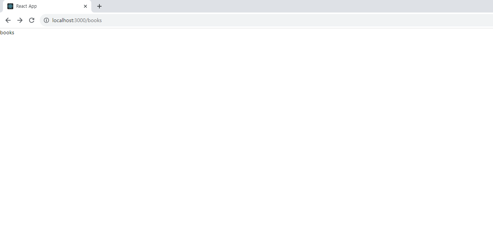
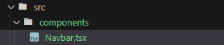
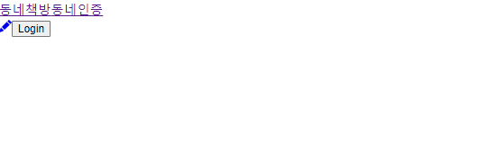

프로젝트 라우터 설정을 먼저 해줍니다. 우선 react-router을 설치해줍니다.

```jsx
yarn add react-router-dom
```

파일 구성은 아래와 같이 합니다.



index.tsx에 라우터 구성을 해줍니다.

```jsx
import React from 'react';
import ReactDOM from 'react-dom/client';
import './index.css';
import App from './App';
import reportWebVitals from './reportWebVitals';
import { createBrowserRouter, RouterProvider } from 'react-router-dom';
import NotFound from './pages/NotFound';
import Allbooks from './pages/Allbooks';
import NewBook from './pages/NewBook';
import Neighborhood from './pages/Neighborhood';
import Home from './pages/Home';

const router = createBrowserRouter([
  {
    path: '/',
    element: <App />,
    errorElement: <NotFound />,
    children: [
      { index: true, path: '/', element: <Home /> },
      { path: '/books', element: <Allbooks /> },
      {
        path: '/books/new',
        element: <NewBook />,
      },
      {
        path: '/neighborhood',
        element: <Neighborhood />,
      },
    ],
  },
]);

const root = ReactDOM.createRoot(document.getElementById('root') as HTMLElement);
root.render(
  <React.StrictMode>
    <RouterProvider router={router} />
  </React.StrictMode>
);
```

그 다음으로 App.tsx에 Outlet을 import 시킵니다. 각 페이지 컴포넌트가 보여져야 하는 부분에 Outlet 컴포넌트를 넣었다.

```jsx
import React from 'react';
import { Outlet } from 'react-router-dom';

function App() {
  return (
    <div>
      <Outlet />
    </div>
  );
}

export default App;
```

주소창에 localhost:3000/books로 검색을 하면 books 페이지로 라우팅이 된 것을 확인할 수 있다.



다음으로 상단의 네비게이션 바를 구성해준다.
우선 src > components 폴더 안에 Navbar.tsx를 생성한다.


그리고 App.tsx에 Navbar를 가져온다.

```jsx
import React from 'react';
import { Outlet } from 'react-router-dom';
import Navbar from './components/Navbar';

function App() {
  return (
    <div>
      <Navbar />
      <Outlet />
    </div>
  );
}

export default App;
```

Navbar의 아이콘 사용을 위해 react-icons 라이브러리를 설치합니다.

```jsx
yarn add react-icons
```

BsFillPencilFill를 react-icons에서 import 하면 아이콘을 사용할 수 있습니다. Link를 사용하면 라우팅한 페이지 주소를 to 속성에 사용해 연결 시켜줄 수 있습니다.

```jsx
import React from 'react';
import { Link } from 'react-router-dom';
import { BsFillPencilFill } from 'react-icons/bs';
export default function Navbar() {
  return (
    <header>
      <nav>
        <Link to='/'>동네책방</Link>
        <Link to='/neighborhood'>동네인증</Link>
      </nav>
      <nav>
        <Link to='/books/new'>
          <BsFillPencilFill />
        </Link>
        <button>Login</button>
      </nav>
    </header>
  );
}
```



위의 사진은 Navbar.tsx를 구현한 것으로 css를 적용하지 않았다. css를 적용하기 위해 tailwindcss를 사용할 것이다.

tailwindcss 링크: https://tailwindcss.com/

```
yarn add -D tailwindcss
npx tailwindcss init
```

npx를 설치하고 tailwind.config.js 파일을 셋팅해준다. content에 js,jsx,ts,tsx 파일 전체를 셋팅한다. 커스텀 컬러를 설정해 자신이 원하는 색을 빠르게 사용할 수 있다.

```js
// tailwind.config.js
/** @type {import('tailwindcss').Config} */
module.exports = {
  content: ['./src/**/*.{js,jsx,ts,tsx}'],
  theme: {
    extend: {
      colors: {
        primary: '#f75866',
      },
    },
  },
  plugins: [],
};
```

그리고 index.css에 아래와 같이 코드를 기입하면 tailwind 셋팅이 완료된다.

```css
@tailwind base;
@tailwind components;
@tailwind utilities;

body {
  margin: 0;
  font-family: -apple-system, ...;
  -webkit-font-smoothing: antialiased;
  -moz-osx-font-smoothing: grayscale;
}

code {
  font-family: source-code-pro, Menlo, Monaco, Consolas, 'Courier New', monospace;
}
```

그리고 최대넓이를 지정해주기 위해 index.css에 스타일 기입을 해준다.

```css
body {
  margin: 0;
  font-family: -apple-system, ...;
  -moz-osx-font-smoothing: grayscale;
  @apply flex flex-col items-center;
}

#root {
  @apply w-full max-w-screen-2xl;
}
```

Navbar 스타일 작업을 위해서 아래와 같이 className에 기입해준다.

```jsx
import React from 'react';
import { Link } from 'react-router-dom';
import { BsFillPencilFill } from 'react-icons/bs';
export default function Navbar() {
  return (
    <header className='flex justify-between border-b border-gray-300 p-2'>
      <nav className='flex items-end gap-4 font-semibold'>
        <Link to='/' className='text-4xl text-primary'>
          store
        </Link>
        <Link to='/neighborhood'>neighborhood</Link>
      </nav>
      <nav className='flex items-center gap-4 font-semibold'>
        <Link to='/books/new' className='text-xl'>
          <BsFillPencilFill />
        </Link>
        <button>Login</button>
      </nav>
    </header>
  );
}
```


페이지가 중간으로 이동했고, tailwind로 스타일링 적용이 완료되었다.
