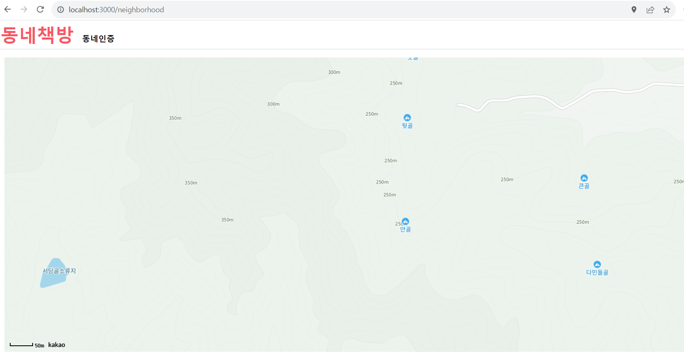

동네 인증은 Neighborhood.tsx 파일에서 구현하겠다.

처음엔 버튼 컴포넌트를 만들어 다른 곳에서도 재사용할 수 있도록 한다.


버튼 위치는 components/ui/Button.tsx이다.

```jsx
import React from 'react';

type ButtonProps = {
  text: string,
  onClick: () => void,
  disabled?: boolean,
};

export default function Button({ text, onClick }: ButtonProps) {
  return (
    <button className='bg-primary text-white py-2 px-4 rounded-sm  hover:brightness-110 flex-shrink-0' onClick={onClick}>
      {text}
    </button>
  );
}
```

위와 같이 버튼 컴포넌트를 구성한다. props로 text와 onClick을 받아옵니다. text로 버튼 타이틀을 설정하고 onClick츠로 버튼 이벤트를 설정합니다.

동네 지도를 구성하기 위해서 아래 사이트를 참고합니다.

https://react-kakao-maps-sdk.jaeseokim.dev/docs/intro

셋팅을 하고 Neighborhood.tsx 파일에 아래와 같이 코드를 작성합니다.

```jsx
import React, { useState } from 'react';
import { Map, MapMarker } from 'react-kakao-maps-sdk';

export default function Neighborhood() {
  const [position, setPosition] = useState({ lng: 36, lat: 128 });

  return (
    <div className='p-4 h-[calc(100vh_-_130px)]'>
      <Map center={{ lat: position.lng, lng: position.lat }} style={{ width: '100%', height: '100%' }} level={3}>
        <MapMarker position={{ lng: position.lng, lat: position.lat }} />
      </Map>
    </div>
  );
}
```

그러면 neighborhood 루트에 카카오 지도가 렌더링됩니다.


그리고 클릭했을 때 클릭한 위치에 마커를 표시하고 position을 state로 구성합니다.

```jsx
import React, { useState } from 'react';
import { Map, MapMarker } from 'react-kakao-maps-sdk';

export default function Neighborhood() {
  const [position, setPosition] = useState({ lng: 128, lat: 38 });

  return (
    <div className='p-4 h-[calc(100vh_-_130px)]'>
      <Map
        center={{ lat: position.lat, lng: position.lng }}
        style={{ width: '100%', height: '100%' }}
        level={3}
        onClick={(_t, mouseEvent) =>
          setPosition({
            lat: mouseEvent.latLng.getLat(),
            lng: mouseEvent.latLng.getLng(),
          })
        }>
        <MapMarker position={{ lng: position.lng, lat: position.lat }} />
      </Map>
    </div>
  );
}
```
