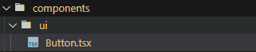

동네 인증은 Neighborhood.tsx 파일에서 구현하겠다.

처음엔 버튼 컴포넌트를 만들어 다른 곳에서도 재사용할 수 있도록 한다.


버튼 위치는 components/ui/Button.tsx이다.

```jsx
import React from 'react';

type ButtonProps = {
  text: string,
  onClick: () => void,
  disabled?: boolean,
};

export default function Button({ text, onClick }: ButtonProps) {
  return (
    <button className='bg-primary text-white py-2 px-4 rounded-sm  hover:brightness-110 flex-shrink-0' onClick={onClick}>
      {text}
    </button>
  );
}
```

위와 같이 버튼 컴포넌트를 구성한다. props로 text와 onClick을 받아옵니다. text로 버튼 타이틀을 설정하고 onClick츠로 버튼 이벤트를 설정합니다.

동네 지도를 구성하기 위해서 아래 사이트를 참고합니다.

https://react-kakao-maps-sdk.jaeseokim.dev/docs/intro

셋팅을 하고 Neighborhood.tsx 파일에 아래와 같이 코드를 작성합니다.

```jsx
import React, { useState } from 'react';
import { Map, MapMarker } from 'react-kakao-maps-sdk';

export default function Neighborhood() {
  const [position, setPosition] = useState({ lng: 36, lat: 128 });

  return (
    <div className='p-4 h-[calc(100vh_-_130px)]'>
      <Map center={{ lat: position.lng, lng: position.lat }} style={{ width: '100%', height: '100%' }} level={3}>
        <MapMarker position={{ lng: position.lng, lat: position.lat }} />
      </Map>
    </div>
  );
}
```

그러면 neighborhood 루트에 카카오 지도가 렌더링됩니다.


그리고 클릭했을 때 클릭한 위치에 마커를 표시하고 position을 state로 구성합니다.

```jsx
import React, { useState } from 'react';
import { Map, MapMarker } from 'react-kakao-maps-sdk';

export default function Neighborhood() {
  const [position, setPosition] = useState({ lng: 128, lat: 38 });

  return (
    <div className='p-4 h-[calc(100vh_-_130px)]'>
      <Map
        center={{ lat: position.lat, lng: position.lng }}
        style={{ width: '100%', height: '100%' }}
        level={3}
        onClick={(_t, mouseEvent) =>
          setPosition({
            lat: mouseEvent.latLng.getLat(),
            lng: mouseEvent.latLng.getLng(),
          })
        }>
        <MapMarker position={{ lng: position.lng, lat: position.lat }} />
      </Map>
    </div>
  );
}
```

다음으로 초기 셋팅을 위해 우선 현재 위치를 받아옵니다.
현재 위치값을 얻기 위해서 navigator를 사용하는 react hooks를 사용한다. 아래는 참조한 사이트이다.
https://doooodle932.tistory.com/159
useGeoLocation.tsx 파일을 hooks 폴더 안에 넣어준다.

일단 useGeoLocation을 사용해서 location 값을 받아온다.

```jsx
...
import { useGeoLocation } from '../hooks/useGeoLocation';

const geolocationOptions = {
  enableHighAccuracy: true,
  timeout: 1000 * 10,
  maximumAge: 1000 * 3600 * 24,
};


export default function Neighborhood() {
  const { location } = useGeoLocation(geolocationOptions);
  console.log(location.longitude)
  ...
}
```

콘솔로 찍어서 객체안에 latitude와 longitude 값이 들어오면 위치 값이 정상적으로 셋팅된 것이다.
useEffect를 사용해 로케이션 값이 셋팅되면 positsion을 셋팅하도록 작업한다.
그리고 좌표값을 이용해 동네 설정하는 부분까지 같이 작업해준다.

```jsx
...
import React, { useState, useEffect } from 'react';
import { Map, MapMarker } from 'react-kakao-maps-sdk';
import { useGeoLocation } from '../hooks/useGeoLocation';
import { useNavigate } from 'react-router-dom';
import Button from '../components/ui/Button';

const geolocationOptions = {
  enableHighAccuracy: true,
  timeout: 1000 * 10,
  maximumAge: 1000 * 3600 * 24,
};

export default function Neighborhood() {
  const { location } = useGeoLocation(geolocationOptions);

  const [neighborhood, setNeighborhood] = useState('');
  const [position, setPosition] = useState({ lng: 0, lat: 0 });

  useEffect(() => {
    location && getNeighborhood();

    function getNeighborhood() {
      if (position.lng === 0) setPosition({ lng: location?.longitude, lat: location?.latitude });

      const geocoder = new kakao.maps.services.Geocoder(); // 좌표 -> 주소로 변환해주는 객체
      const callback = function (result, status) {
        if (status === kakao.maps.services.Status.OK) {
          const address = result[0].address.region_3depth_name;
          setNeighborhood(address);
        }
      };
      geocoder.coord2Address(position.lng, position.lat, callback);
    }
  }, [location, position]);

  return (
    <div className='p-4 h-[calc(100vh_-_130px)]'>
      <Map
        center={{
          lat: location?.latitude ? location.latitude : 33,
          lng: location?.longitude ? location.longitude : 33,
        }}
        style={{ width: '100%', height: '100%' }}
        level={3}
        onClick={(_t, mouseEvent) =>
          setPosition({
            lat: mouseEvent.latLng.getLat(),
            lng: mouseEvent.latLng.getLng(),
          })
        }>
        <MapMarker // 마커를 생성합니다
          position={{ lng: position.lng, lat: position.lat }}
        />
      </Map>
      <section className='mt-5 flex justify-between items-center'>
        <article className='flex gap-2 text-lg'>
          <p>마커를 움직여 동네를 설정해주세요.</p>
          <p className='font-semibold'>내 동네</p>
          <span className='text-brand font-bold'>{neighborhood}</span>
        </article>
      </section>
    </div>
  );
}
```

여기까지 작업하면 useEffect에서 location에 값이 셋팅되면 getNeighborhood가 실행되면서 동네 값을 셋팅해주고, position 값이 변경되어도 useEffect 내에서 동네를 셋팅시켜준다.

useNavigate를 사용해 자신의 동네를 저장하면 시작화면으로 가도록 구성해준다.

```jsx
...
import React, { useState, useEffect } from 'react';
import { Map, MapMarker } from 'react-kakao-maps-sdk';
import { useGeoLocation } from '../hooks/useGeoLocation';
import { useNavigate } from 'react-router-dom';
import Button from '../components/ui/Button';

const geolocationOptions = {
  enableHighAccuracy: true,
  timeout: 1000 * 10,
  maximumAge: 1000 * 3600 * 24,
};

export default function Neighborhood() {
  const { location } = useGeoLocation(geolocationOptions);
  const navigate = useNavigate();

  const [neighborhood, setNeighborhood] = useState('');
  const [position, setPosition] = useState({ lng: NaN, lat: NaN });

  useEffect(() => {
    location && getNeighborhood();

    function getNeighborhood() {
      if (isNaN(position.lng)) setPosition({ lng: location?.longitude, lat: location?.latitude });

      const geocoder = new kakao.maps.services.Geocoder(); // 좌표 -> 주소로 변환해주는 객체
      const callback = function (result, status) {
        if (status === kakao.maps.services.Status.OK) {
          const address = result[0].address.region_3depth_name;
          setNeighborhood(address);
        }
      };
      geocoder.coord2Address(position.lng, position.lat, callback);
    }
  }, [location, position]);

  async function handleSubmit() {
    navigate('/', { state: { status: 'success' } });
  }

  return (
    <div className='p-4 h-[calc(100vh_-_130px)]'>
      <Map
        center={{
          lat: location?.latitude ? location.latitude : 33,
          lng: location?.longitude ? location.longitude : 33,
        }}
        style={{ width: '100%', height: '100%' }}
        level={3}
        onClick={(_t, mouseEvent) =>
          setPosition({
            lat: mouseEvent.latLng.getLat(),
            lng: mouseEvent.latLng.getLng(),
          })
        }>
        <MapMarker // 마커를 생성합니다
          position={{ lng: position.lng, lat: position.lat }}
        />
      </Map>
      <section className='mt-5 flex justify-between items-center'>
        <article className='flex gap-2 text-lg'>
          <p>마커를 움직여 동네를 설정해주세요.</p>
          <p className='font-semibold'>내 동네</p>
          <span className='text-brand font-bold'>{neighborhood}</span>
        </article>
        <article className='flex gap-4'>
          <Button text={'동네 저장하기'} onClick={handleSubmit} />
        </article>
      </section>
    </div>
  );
}
```

1차로 여기까지 끝내고 다음은 동네 정보를 firebase에 저장하는 작업을 하도록 하겠다.
